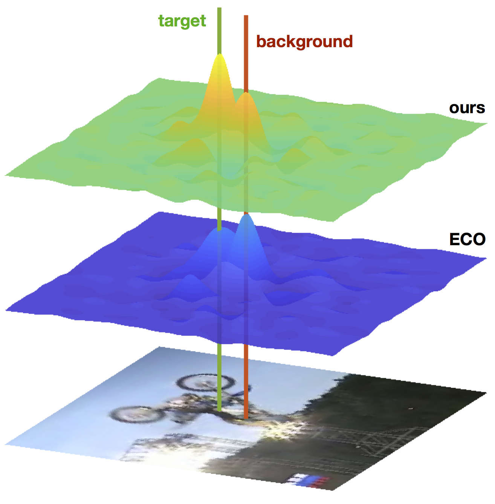
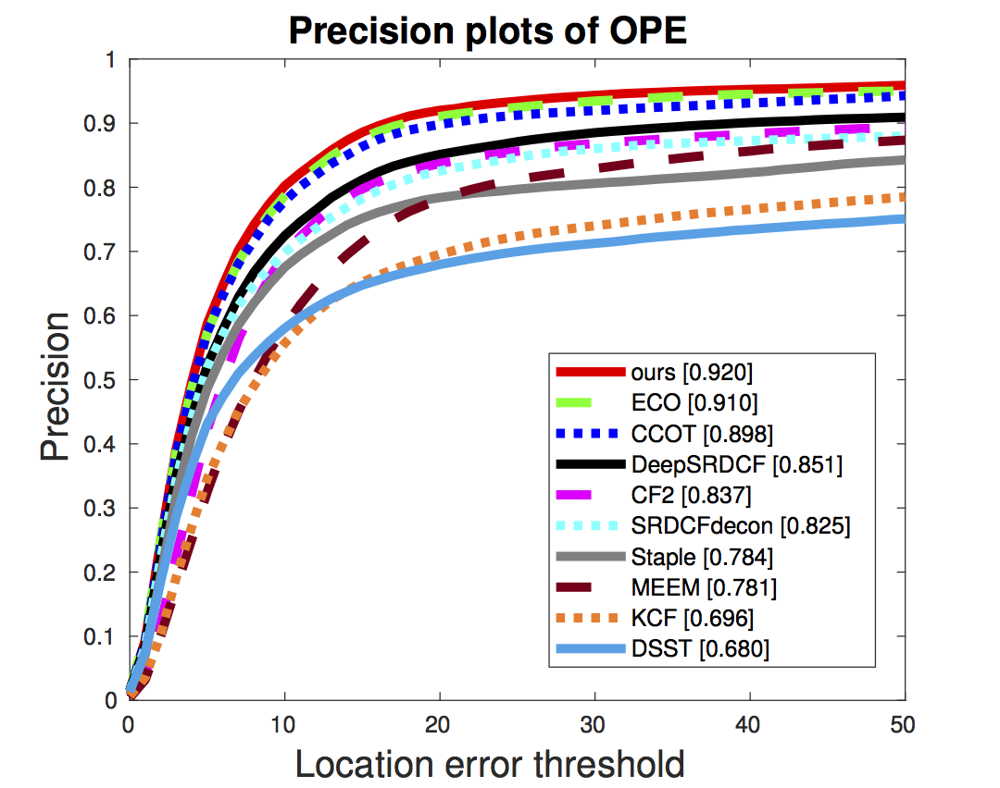
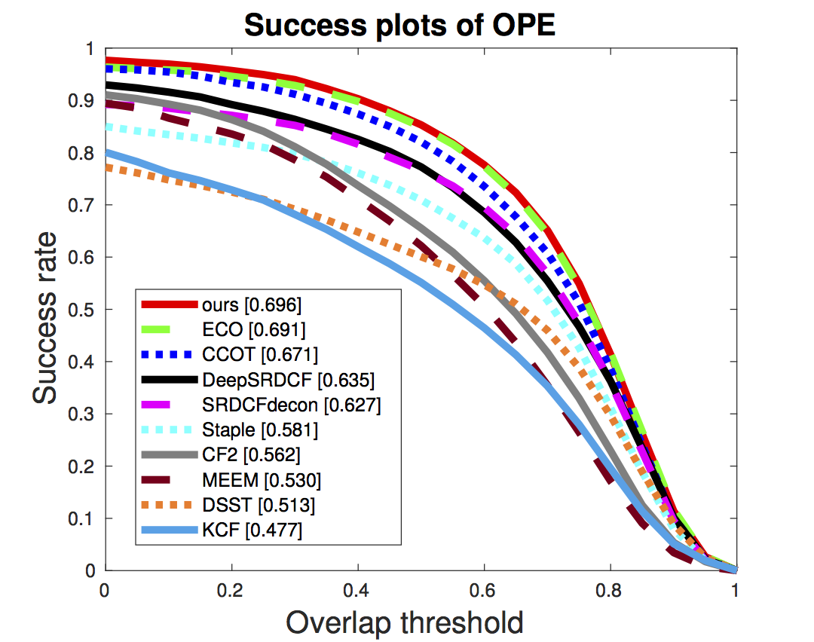

RACF
---

Matlab implementation of the Rotation-Aware Correlation Filters for Visual Tracking (RACF). Raw benchmark results can be found in `results/`.

This repository is forked from the ECO repo. For core modifications you can refer to the `RACF bundle (source code)` commit.

## Usage
* configure dependencies use `git submodule init && git submodule update`
* run `install.m`
* run `demo_ECO(_gpu).m` for visualization

## OTB-2015 Results
<table>
  <tr>
    <td></td>
    <td></td>
  </tr>
</table>

## VOT-2016 Results

|   | EAO | A | R |
| --- |:-------------:|:-----:| :----:|
| **ours** | **0.384** | **0.561** | **0.200** |
| ECO  | 0.374 | 0.548 | 0.210 |
| C-COT| 0.331 | 0.539 | 0.238 |
| TCNN | 0.325 | 0.554 | 0.268 |
| Staple| 0.295 | 0.544 | 0.378 |

## VOT-2017 Results

|   | EAO | A | R |
| --- |:-------------:|:-----:| :----:|
| **ours** | **0.320** | 0.503 | **0.248** |
| CFCF  | 0.286 | **0.509** | 0.281 |
| ECO| 0.280 | 0.483 | 0.276 |
| C-COT | 0.267 | 0.494 | 0.318 |
